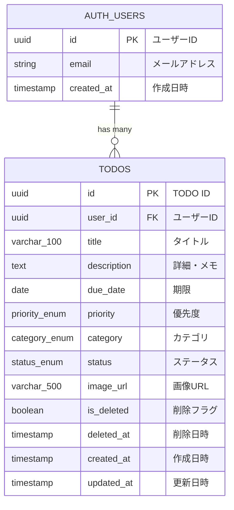

# TODOアプリケーション データベース設計書

## 1. 概要

### 1.1 データベース環境
- **データベース**: PostgreSQL（Supabase）
- **認証**: Supabase Auth（auth.usersテーブルを使用）
- **ストレージ**: Supabase Storage（画像保存）

### 1.2 設計方針
- Supabase Authの`auth.users`テーブルをユーザー管理に使用
- Row Level Security（RLS）でデータアクセスを制御
- 外部キーは`参照先テーブル名_id`の命名規則を使用
- タイムスタンプは全てUTC

---

## 2. ER図



---

## 3. テーブル定義

### 3.1 ENUM型定義

#### priority（優先度）

| 値 | 表示名 | 説明 |
|----|--------|------|
| high | 高 | 優先度高 |
| medium | 中 | 優先度中（デフォルト） |
| low | 低 | 優先度低 |

#### category（カテゴリ）

| 値 | 表示名 | 説明 |
|----|--------|------|
| work | 仕事 | 仕事関連のタスク |
| private | プライベート | 個人的なタスク |
| shopping | 買い物 | 買い物リスト |
| study | 勉強 | 学習関連のタスク |
| other | その他 | その他のタスク（デフォルト） |

#### status（ステータス）

| 値 | 表示名 | 説明 |
|----|--------|------|
| not_started | 未着手 | まだ開始していない（デフォルト） |
| in_progress | 進行中 | 作業中 |
| completed | 完了 | 完了済み |

---

### 3.2 todosテーブル

TODOデータを管理するメインテーブル。

| カラム名 | データ型 | NULL | デフォルト | 説明 |
|----------|----------|------|------------|------|
| id | UUID | NOT NULL | gen_random_uuid() | 主キー |
| user_id | UUID | NOT NULL | - | ユーザーID（auth.users.id） |
| title | VARCHAR(100) | NOT NULL | - | タイトル（最大100文字） |
| description | TEXT | NULL | NULL | 詳細・メモ |
| due_date | DATE | NULL | NULL | 期限 |
| priority | priority_enum | NOT NULL | 'medium' | 優先度 |
| category | category_enum | NOT NULL | 'other' | カテゴリ |
| status | status_enum | NOT NULL | 'not_started' | ステータス |
| image_url | VARCHAR(500) | NULL | NULL | 添付画像のURL |
| is_deleted | BOOLEAN | NOT NULL | FALSE | 削除フラグ（ゴミ箱） |
| deleted_at | TIMESTAMPTZ | NULL | NULL | 削除日時 |
| created_at | TIMESTAMPTZ | NOT NULL | NOW() | 作成日時 |
| updated_at | TIMESTAMPTZ | NOT NULL | NOW() | 更新日時 |

**制約**:
- PRIMARY KEY: `id`
- FOREIGN KEY: `user_id` → `auth.users(id)` ON DELETE CASCADE
- CHECK: `title`が空文字でないこと

**インデックス**:
- `idx_todos_user_id`: user_id（ユーザー別検索用）
- `idx_todos_user_status`: user_id, is_deleted, status（一覧表示用複合インデックス）
- `idx_todos_user_deleted`: user_id, is_deleted（ゴミ箱表示用）

---

## 4. Row Level Security（RLS）ポリシー

### 4.1 todosテーブルのRLSポリシー

| ポリシー名 | 操作 | 条件 | 説明 |
|------------|------|------|------|
| todos_select_policy | SELECT | user_id = auth.uid() | 自分のTODOのみ閲覧可能 |
| todos_insert_policy | INSERT | user_id = auth.uid() | 自分のTODOのみ作成可能 |
| todos_update_policy | UPDATE | user_id = auth.uid() | 自分のTODOのみ更新可能 |
| todos_delete_policy | DELETE | user_id = auth.uid() | 自分のTODOのみ削除可能 |

---

## 5. Supabase Storage設定

### 5.1 バケット設定

| バケット名 | 公開設定 | 説明 |
|------------|----------|------|
| todo-images | Private | TODO添付画像用 |

### 5.2 ストレージポリシー

| ポリシー名 | 操作 | 条件 | 説明 |
|------------|------|------|------|
| todo_images_select | SELECT | 認証済みユーザー | 自分の画像のみ閲覧可能 |
| todo_images_insert | INSERT | 認証済みユーザー | 自分のフォルダにのみアップロード可能 |
| todo_images_delete | DELETE | 認証済みユーザー | 自分の画像のみ削除可能 |

### 5.3 ファイルパス規則

```
todo-images/{user_id}/{todo_id}/{filename}
```

例: `todo-images/123e4567-e89b-12d3-a456-426614174000/987fcdeb-51a2-3bc4-d567-890123456789/reference.jpg`

---

## 6. SQLスクリプト

### 6.1 ENUM型作成

```sql
-- 優先度ENUM
CREATE TYPE priority_enum AS ENUM ('high', 'medium', 'low');

-- カテゴリENUM
CREATE TYPE category_enum AS ENUM ('work', 'private', 'shopping', 'study', 'other');

-- ステータスENUM
CREATE TYPE status_enum AS ENUM ('not_started', 'in_progress', 'completed');
```

### 6.2 todosテーブル作成

```sql
-- todosテーブル作成
CREATE TABLE todos (
    id UUID PRIMARY KEY DEFAULT gen_random_uuid(),
    user_id UUID NOT NULL REFERENCES auth.users(id) ON DELETE CASCADE,
    title VARCHAR(100) NOT NULL CHECK (title <> ''),
    description TEXT,
    due_date DATE,
    priority priority_enum NOT NULL DEFAULT 'medium',
    category category_enum NOT NULL DEFAULT 'other',
    status status_enum NOT NULL DEFAULT 'not_started',
    image_url VARCHAR(500),
    is_deleted BOOLEAN NOT NULL DEFAULT FALSE,
    deleted_at TIMESTAMPTZ,
    created_at TIMESTAMPTZ NOT NULL DEFAULT NOW(),
    updated_at TIMESTAMPTZ NOT NULL DEFAULT NOW()
);

-- コメント追加
COMMENT ON TABLE todos IS 'TODOタスク管理テーブル';
COMMENT ON COLUMN todos.id IS 'TODO一意識別子';
COMMENT ON COLUMN todos.user_id IS '所有ユーザーID';
COMMENT ON COLUMN todos.title IS 'タイトル（最大100文字）';
COMMENT ON COLUMN todos.description IS '詳細・メモ';
COMMENT ON COLUMN todos.due_date IS '期限日';
COMMENT ON COLUMN todos.priority IS '優先度（high/medium/low）';
COMMENT ON COLUMN todos.category IS 'カテゴリ（work/private/shopping/study/other）';
COMMENT ON COLUMN todos.status IS 'ステータス（not_started/in_progress/completed）';
COMMENT ON COLUMN todos.image_url IS '添付画像URL';
COMMENT ON COLUMN todos.is_deleted IS '削除フラグ（TRUE=ゴミ箱）';
COMMENT ON COLUMN todos.deleted_at IS 'ゴミ箱移動日時';
COMMENT ON COLUMN todos.created_at IS '作成日時';
COMMENT ON COLUMN todos.updated_at IS '更新日時';
```

### 6.3 インデックス作成

```sql
-- ユーザー別検索用インデックス
CREATE INDEX idx_todos_user_id ON todos(user_id);

-- 一覧表示用複合インデックス（ユーザー + 削除フラグ + ステータス）
CREATE INDEX idx_todos_user_status ON todos(user_id, is_deleted, status);

-- ゴミ箱表示用インデックス
CREATE INDEX idx_todos_user_deleted ON todos(user_id, is_deleted) WHERE is_deleted = TRUE;
```

### 6.4 updated_at自動更新トリガー

```sql
-- updated_at自動更新関数
CREATE OR REPLACE FUNCTION update_updated_at_column()
RETURNS TRIGGER AS $$
BEGIN
    NEW.updated_at = NOW();
    RETURN NEW;
END;
$$ LANGUAGE plpgsql;

-- todosテーブルにトリガー適用
CREATE TRIGGER trigger_todos_updated_at
    BEFORE UPDATE ON todos
    FOR EACH ROW
    EXECUTE FUNCTION update_updated_at_column();
```

### 6.5 RLSポリシー設定

```sql
-- RLS有効化
ALTER TABLE todos ENABLE ROW LEVEL SECURITY;

-- SELECTポリシー：自分のTODOのみ閲覧可能
CREATE POLICY todos_select_policy ON todos
    FOR SELECT
    USING (auth.uid() = user_id);

-- INSERTポリシー：自分のTODOのみ作成可能
CREATE POLICY todos_insert_policy ON todos
    FOR INSERT
    WITH CHECK (auth.uid() = user_id);

-- UPDATEポリシー：自分のTODOのみ更新可能
CREATE POLICY todos_update_policy ON todos
    FOR UPDATE
    USING (auth.uid() = user_id)
    WITH CHECK (auth.uid() = user_id);

-- DELETEポリシー：自分のTODOのみ削除可能
CREATE POLICY todos_delete_policy ON todos
    FOR DELETE
    USING (auth.uid() = user_id);
```

### 6.6 Storageバケット・ポリシー設定

```sql
-- バケット作成（Supabase Dashboardまたは以下のSQL）
INSERT INTO storage.buckets (id, name, public)
VALUES ('todo-images', 'todo-images', FALSE);

-- SELECT（閲覧）ポリシー
CREATE POLICY "Users can view own images"
ON storage.objects FOR SELECT
USING (
    bucket_id = 'todo-images'
    AND auth.uid()::text = (storage.foldername(name))[1]
);

-- INSERT（アップロード）ポリシー
CREATE POLICY "Users can upload own images"
ON storage.objects FOR INSERT
WITH CHECK (
    bucket_id = 'todo-images'
    AND auth.uid()::text = (storage.foldername(name))[1]
);

-- DELETE（削除）ポリシー
CREATE POLICY "Users can delete own images"
ON storage.objects FOR DELETE
USING (
    bucket_id = 'todo-images'
    AND auth.uid()::text = (storage.foldername(name))[1]
);
```

---

## 7. データ操作例

### 7.1 TODO一覧取得（未削除・未完了）

```sql
SELECT
    id,
    title,
    description,
    due_date,
    priority,
    category,
    status,
    image_url,
    created_at
FROM todos
WHERE
    user_id = auth.uid()
    AND is_deleted = FALSE
    AND status != 'completed'
ORDER BY
    CASE priority
        WHEN 'high' THEN 1
        WHEN 'medium' THEN 2
        WHEN 'low' THEN 3
    END,
    due_date ASC NULLS LAST,
    created_at DESC;
```

### 7.2 TODO作成

```sql
INSERT INTO todos (user_id, title, description, due_date, priority, category)
VALUES (
    auth.uid(),
    '企画書の作成',
    '新規プロジェクトの企画書を作成する',
    '2025-01-15',
    'high',
    'work'
)
RETURNING *;
```

### 7.3 ステータス更新

```sql
UPDATE todos
SET status = 'in_progress'
WHERE id = '対象のTODO ID'
AND user_id = auth.uid();
```

### 7.4 ゴミ箱へ移動（論理削除）

```sql
UPDATE todos
SET
    is_deleted = TRUE,
    deleted_at = NOW()
WHERE id = '対象のTODO ID'
AND user_id = auth.uid();
```

### 7.5 ゴミ箱から復元

```sql
UPDATE todos
SET
    is_deleted = FALSE,
    deleted_at = NULL
WHERE id = '対象のTODO ID'
AND user_id = auth.uid();
```

### 7.6 完全削除

```sql
DELETE FROM todos
WHERE id = '対象のTODO ID'
AND user_id = auth.uid()
AND is_deleted = TRUE;
```

### 7.7 キーワード検索

```sql
SELECT *
FROM todos
WHERE
    user_id = auth.uid()
    AND is_deleted = FALSE
    AND (
        title ILIKE '%検索キーワード%'
        OR description ILIKE '%検索キーワード%'
    )
ORDER BY created_at DESC;
```

### 7.8 ステータスフィルター

```sql
SELECT *
FROM todos
WHERE
    user_id = auth.uid()
    AND is_deleted = FALSE
    AND status = 'in_progress'
ORDER BY created_at DESC;
```

---

## 8. マイグレーション手順

### 8.1 初期セットアップ手順

1. Supabaseプロジェクトを作成
2. SQL Editorで以下を順番に実行：
   - ENUM型作成（6.1）
   - todosテーブル作成（6.2）
   - インデックス作成（6.3）
   - トリガー作成（6.4）
   - RLSポリシー設定（6.5）
   - Storageバケット・ポリシー設定（6.6）

### 8.2 確認事項

- [ ] ENUM型が正しく作成されているか
- [ ] todosテーブルが作成されているか
- [ ] インデックスが作成されているか
- [ ] RLSが有効化されているか
- [ ] RLSポリシーが正しく設定されているか
- [ ] Storageバケットが作成されているか
- [ ] Storageポリシーが設定されているか

---

## 9. 改訂履歴

| バージョン | 日付 | 内容 |
|------------|------|------|
| 1.0 | 2025-01-12 | 初版作成 |
