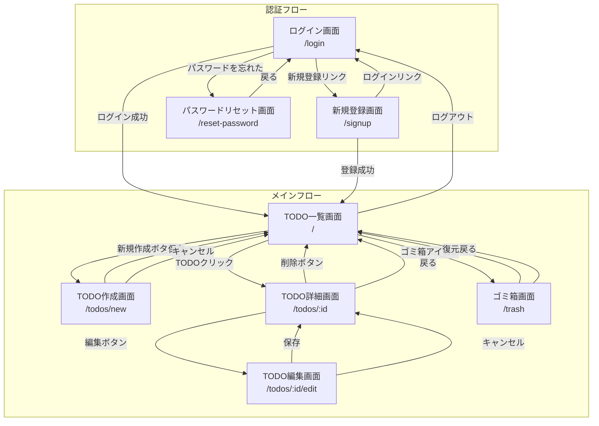

# TODOアプリケーション 画面設計書

## 1. 画面フロー図



---

## 2. 画面一覧

| 画面ID | 画面名 | パス | 認証 | 説明 |
|--------|--------|------|------|------|
| SCR-001 | ログイン画面 | /login | 不要 | ユーザー認証 |
| SCR-002 | 新規登録画面 | /signup | 不要 | アカウント作成 |
| SCR-003 | パスワードリセット画面 | /reset-password | 不要 | パスワード再設定 |
| SCR-004 | TODO一覧画面 | / | 必要 | TODOリスト表示（ホーム） |
| SCR-005 | TODO作成画面 | /todos/new | 必要 | 新規TODO作成 |
| SCR-006 | TODO詳細画面 | /todos/:id | 必要 | TODO詳細表示 |
| SCR-007 | TODO編集画面 | /todos/:id/edit | 必要 | TODO編集 |
| SCR-008 | ゴミ箱画面 | /trash | 必要 | 削除済みTODO管理 |

---

## 3. 画面詳細仕様

### 3.1 SCR-001: ログイン画面

**パス**: `/login`

**レイアウト**: センター配置のカード形式

**要素一覧**:

| 要素 | タイプ | 必須 | バリデーション | 備考 |
|------|--------|------|----------------|------|
| ロゴ | 画像 | - | - | アプリロゴ |
| メールアドレス | テキスト入力 | ○ | メール形式 | - |
| パスワード | パスワード入力 | ○ | - | - |
| ログインボタン | ボタン | - | - | プライマリボタン |
| 新規登録リンク | リンク | - | - | SCR-002へ遷移 |
| パスワードを忘れた方リンク | リンク | - | - | SCR-003へ遷移 |

**アクション**:
- ログイン成功 → TODO一覧画面（SCR-004）へ遷移
- ログイン失敗 → エラーメッセージ表示

---

### 3.2 SCR-002: 新規登録画面

**パス**: `/signup`

**レイアウト**: センター配置のカード形式

**要素一覧**:

| 要素 | タイプ | 必須 | バリデーション | 備考 |
|------|--------|------|----------------|------|
| ロゴ | 画像 | - | - | アプリロゴ |
| メールアドレス | テキスト入力 | ○ | メール形式 | - |
| パスワード | パスワード入力 | ○ | 8文字以上 | - |
| パスワード確認 | パスワード入力 | ○ | パスワードと一致 | - |
| 登録ボタン | ボタン | - | - | プライマリボタン |
| ログインリンク | リンク | - | - | SCR-001へ遷移 |

**アクション**:
- 登録成功 → TODO一覧画面（SCR-004）へ遷移
- 登録失敗 → エラーメッセージ表示

---

### 3.3 SCR-003: パスワードリセット画面

**パス**: `/reset-password`

**レイアウト**: センター配置のカード形式

**要素一覧**:

| 要素 | タイプ | 必須 | バリデーション | 備考 |
|------|--------|------|----------------|------|
| アイコン | アイコン | - | - | 鍵アイコン |
| メールアドレス | テキスト入力 | ○ | メール形式 | - |
| 送信ボタン | ボタン | - | - | プライマリボタン |
| 戻るリンク | リンク | - | - | SCR-001へ遷移 |

**アクション**:
- 送信成功 → 完了メッセージ表示
- 送信失敗 → エラーメッセージ表示

---

### 3.4 SCR-004: TODO一覧画面

**パス**: `/`

**レイアウト**: ヘッダー + メインコンテンツ

**ヘッダー要素**:

| 要素 | タイプ | 説明 |
|------|--------|------|
| アプリタイトル | テキスト | 「TODO一覧」 |
| ゴミ箱アイコン | ボタン | SCR-008へ遷移 |
| ログアウトボタン | ボタン | ログアウト処理 |

**フィルター・検索エリア**:

| 要素 | タイプ | 説明 |
|------|--------|------|
| 検索バー | テキスト入力 | タイトル・詳細で検索 |
| ステータスフィルター | セレクト | すべて / 未着手 / 進行中 / 完了 |
| 新規作成ボタン | ボタン | SCR-005へ遷移 |

**TODOリスト要素（1件あたり）**:

| 要素 | タイプ | 説明 |
|------|--------|------|
| 優先度バッジ | バッジ | 高（赤）/ 中（黄）/ 低（グレー） |
| カテゴリバッジ | バッジ | カテゴリ名と色 |
| タイトル | テキスト | TODOタイトル |
| 詳細（一部） | テキスト | 詳細の先頭部分 |
| 期限 | テキスト | 期限日（設定時のみ） |
| 画像アイコン | アイコン | 画像添付時のみ表示 |
| ステータス変更 | セレクト | ステータス変更ドロップダウン |

**デフォルト表示条件**:
- ステータスが「完了」のTODOは非表示
- 削除済み（is_deleted = true）のTODOは非表示

**空状態**:
- TODOがない場合は空状態メッセージと作成ボタンを表示

---

### 3.5 SCR-005: TODO作成画面

**パス**: `/todos/new`

**レイアウト**: ヘッダー + フォーム

**フォーム要素**:

| 要素 | タイプ | 必須 | バリデーション | デフォルト値 |
|------|--------|------|----------------|--------------|
| タイトル | テキスト入力 | ○ | 最大100文字 | - |
| 詳細・メモ | テキストエリア | - | - | - |
| 期限 | 日付ピッカー | - | - | - |
| 優先度 | セレクト | ○ | - | 中 |
| カテゴリ | セレクト | ○ | - | その他 |
| 画像 | ファイルアップロード | - | JPEG,PNG,GIF,WebP / 最大5MB | - |
| キャンセルボタン | ボタン | - | - | - |
| 保存ボタン | ボタン | - | - | プライマリ |

**アクション**:
- 保存成功 → TODO一覧画面（SCR-004）へ遷移
- キャンセル → TODO一覧画面（SCR-004）へ遷移

---

### 3.6 SCR-006: TODO詳細画面

**パス**: `/todos/:id`

**レイアウト**: ヘッダー + コンテンツ

**ヘッダー要素**:

| 要素 | タイプ | 説明 |
|------|--------|------|
| 戻るボタン | ボタン | SCR-004へ遷移 |
| 編集ボタン | ボタン | SCR-007へ遷移 |
| 削除ボタン | ボタン | 確認ダイアログ表示 |

**コンテンツ要素**:

| 要素 | タイプ | 説明 |
|------|--------|------|
| 優先度バッジ | バッジ | 優先度表示 |
| カテゴリバッジ | バッジ | カテゴリ表示 |
| タイトル | 見出し | TODOタイトル |
| ステータス変更 | セレクト | ステータス変更可能 |
| 詳細・メモ | テキスト | 詳細内容 |
| 期限 | テキスト | 期限日 |
| 作成日 | テキスト | 作成日時 |
| 添付画像 | 画像 | 画像がある場合表示 |

**削除確認ダイアログ**:
- メッセージ: 「このTODOをゴミ箱に移動しますか？」
- キャンセルボタン
- 削除ボタン

---

### 3.7 SCR-007: TODO編集画面

**パス**: `/todos/:id/edit`

**レイアウト**: ヘッダー + フォーム

**フォーム要素**:

| 要素 | タイプ | 必須 | バリデーション | 初期値 |
|------|--------|------|----------------|--------|
| タイトル | テキスト入力 | ○ | 最大100文字 | 既存値 |
| 詳細・メモ | テキストエリア | - | - | 既存値 |
| 期限 | 日付ピッカー | - | - | 既存値 |
| 優先度 | セレクト | ○ | - | 既存値 |
| カテゴリ | セレクト | ○ | - | 既存値 |
| ステータス | セレクト | ○ | - | 既存値 |
| 画像プレビュー | 画像 | - | - | 既存画像 |
| 画像削除ボタン | ボタン | - | - | 画像がある場合表示 |
| 画像アップロード | ファイル | - | JPEG,PNG,GIF,WebP / 最大5MB | - |
| キャンセルボタン | ボタン | - | - | - |
| 更新ボタン | ボタン | - | - | プライマリ |

**アクション**:
- 更新成功 → TODO詳細画面（SCR-006）へ遷移
- キャンセル → TODO詳細画面（SCR-006）へ遷移

---

### 3.8 SCR-008: ゴミ箱画面

**パス**: `/trash`

**レイアウト**: ヘッダー + リスト

**ヘッダー要素**:

| 要素 | タイプ | 説明 |
|------|--------|------|
| 戻るボタン | ボタン | SCR-004へ遷移 |
| タイトル | テキスト | 「ゴミ箱」 |

**リスト要素（1件あたり）**:

| 要素 | タイプ | 説明 |
|------|--------|------|
| タイトル | テキスト | TODOタイトル |
| 削除日 | テキスト | 削除された日時 |
| 復元ボタン | ボタン | TODOを復元 |
| 完全削除ボタン | ボタン | 確認後完全削除 |

**完全削除確認ダイアログ**:
- メッセージ: 「このTODOを完全に削除しますか？この操作は取り消せません。」
- キャンセルボタン
- 削除ボタン

**空状態**:
- ゴミ箱が空の場合は空状態メッセージを表示

---

## 4. 共通コンポーネント

### 4.1 ヘッダー（認証後）

```
+----------------------------------------------------------+
|  📝 TODO一覧                    🗑️ ゴミ箱  | ログアウト |
+----------------------------------------------------------+
```

### 4.2 優先度バッジ

| 優先度 | 背景色 | 文字色 |
|--------|--------|--------|
| 高 | red-100 | red-600 |
| 中 | yellow-100 | yellow-600 |
| 低 | gray-100 | gray-600 |

### 4.3 カテゴリバッジ

| カテゴリ | 背景色 | 文字色 |
|----------|--------|--------|
| 仕事 | blue-100 | blue-600 |
| プライベート | pink-100 | pink-600 |
| 買い物 | green-100 | green-600 |
| 勉強 | purple-100 | purple-600 |
| その他 | gray-100 | gray-600 |

### 4.4 ステータスバッジ

| ステータス | 背景色 | 文字色 |
|------------|--------|--------|
| 未着手 | gray-100 | gray-600 |
| 進行中 | blue-100 | blue-600 |
| 完了 | green-100 | green-600 |

### 4.5 ボタンスタイル

| タイプ | 背景色 | 文字色 | 用途 |
|--------|--------|--------|------|
| プライマリ | blue-500 | white | 主要アクション（保存、登録等） |
| セカンダリ | gray-200 | gray-700 | キャンセル等 |
| デンジャー | red-500 | white | 削除等 |
| ゴースト | transparent | gray-600 | テキストリンク風 |

---

## 5. レスポンシブ対応

### 5.1 ブレークポイント

| サイズ | 幅 | 対象デバイス |
|--------|-----|--------------|
| sm | 640px以上 | スマートフォン（横） |
| md | 768px以上 | タブレット |
| lg | 1024px以上 | デスクトップ |

### 5.2 レイアウト調整

**モバイル（640px未満）**:
- フィルターエリアは縦積み
- TODOリストは1カラム
- フォームは1カラム

**タブレット以上（768px以上）**:
- フィルターエリアは横並び
- フォームの一部は2カラム（期限・優先度など）

---

## 6. 改訂履歴

| バージョン | 日付 | 内容 |
|------------|------|------|
| 1.0 | 2025-01-12 | 初版作成 |
